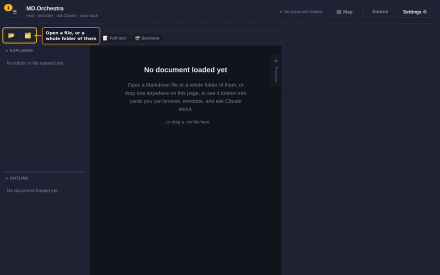
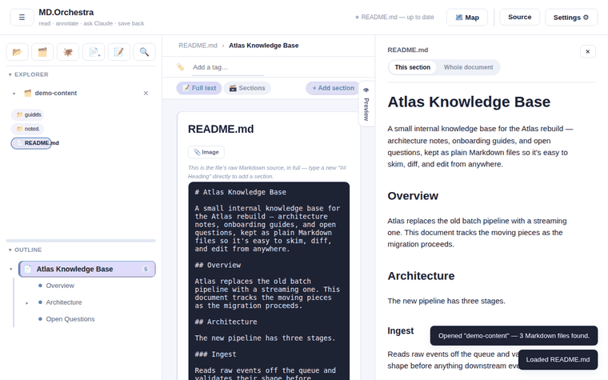
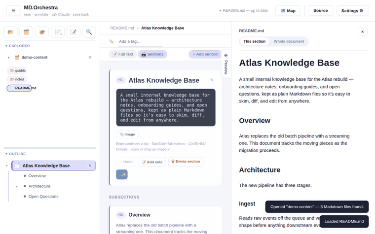
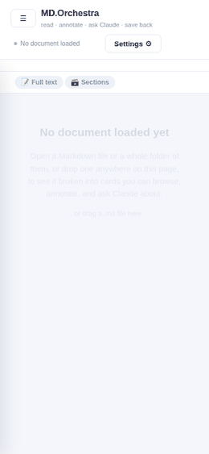
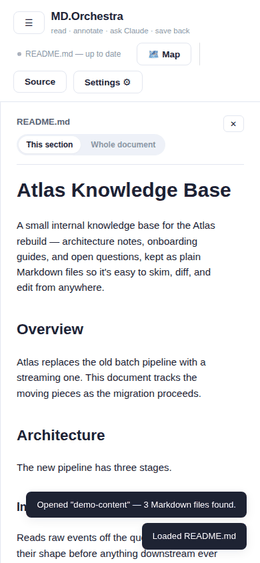

<div align="center">

# MD.Orchestra

**Your `.md` folder, but you can actually see it.**

[](LICENSE)


</div>

You know that folder — forty Markdown files deep, and every time you open
one you're just scrolling, hunting for the one heading you needed.
MD.Orchestra turns it into something you can *navigate*: click through
headings like folders, drop a note on a paragraph without touching its
words, drag a section somewhere else entirely. It all lands right back in
the same plain `.md` files. No database, no lock-in, no "now it's trapped
in our app."

## See it in action

**Navigate and edit — click any heading, it's editable right there.**


**The whole folder, as a graph you can click through.**


**Every unsaved edit tracked, until you decide what to do with it.**


## Get it running

No Node, no npm — just [Docker](https://www.docker.com/):

```bash
./build-desktop.sh
./dist/MD.Orchestra-*.AppImage
```

Double-click works too. A real window, your real files, nothing phoning
home.

## Also on Android

Same app, real device filesystem access via Android's native folder
picker — no browser tab, no import step.

<table>
<tr>
<td align="center" width="50%">

**Open a folder through Android's own picker, browse it, edit a section.**


</td>
<td align="center" width="50%">

**The same Document map — Tree, Mind map, and a pinch-to-zoom Workspace graph.**


</td>
</tr>
</table>

No Play Store listing yet — build the debug APK yourself (needs only
[Docker](https://www.docker.com/)):

```bash
./build-android.sh
adb install -r dist-android/app-debug.apk
```

See **[docs/ANDROID.md](docs/ANDROID.md)** for the full build/run story,
including how to try it on an emulator without a physical device.

## The gist

- **Open a file, or a whole folder.** Several at once, if you're like that.
- **Click a heading, get a card.** Edit right there — no "enter edit mode."
- **Hit Map**, and the whole folder lays itself out as a graph you can click through.
- **Ctrl/⌘+S** commits what you're editing. **Ctrl/⌘+Shift+S** writes it to disk.
- **Crash? Power cut?** Next launch offers your unsaved work right back.
- Every shortcut is one `?` away — nothing here to memorize.

That's it. If you're the type who reads changelogs for fun, the rest lives
in **[MORE.md](MORE.md)**.

---

<div align="center">

Licensed under [MIT](LICENSE).

</div>
