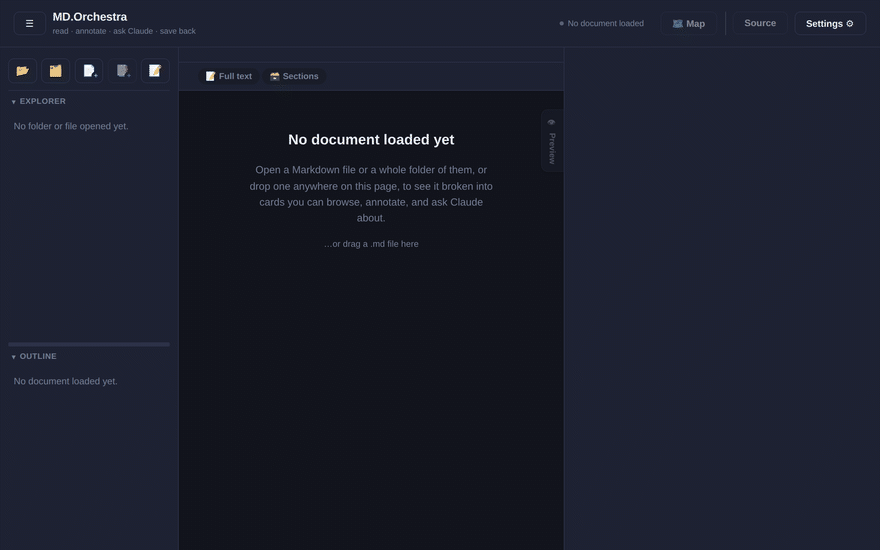

# MD.Orchestra

You know that folder. The one with forty `.md` files in it — notes,
half-finished docs, a README from three projects ago — and every time you
open one, you're just... scrolling. Hunting for the one heading you
actually needed, in a wall of text that doesn't care how you think.

MD.Orchestra is what happens when that folder gets an actual interface.
Open it up and your Markdown turns into something you can *navigate* —
click through headings like folders, drop a sticky note on a paragraph
without touching its actual words, drag a section somewhere else entirely —
and every single change lands right back in the plain `.md` file it came
from. No database, no import/export dance, no "now everything's trapped in
our app" moment. It's still just Markdown. It always was.



## Get it running

You don't need Node.js, npm, or anything else installed for this. Just
[Docker](https://www.docker.com/):

```bash
./build-desktop.sh
```

That builds you a real desktop app and drops it in `dist/`. When it's done:

```bash
./dist/MD.Orchestra-*.AppImage
```

Double-click works too. That's it — no installer, no accounts, nothing
"phoning home." It opens as its own window, remembers the last folder you
had open, and reads/writes real files on your disk like any other desktop
app should.

*(Already have Node? `npm install && npm start` skips the Docker step. And
if you just want to poke at the code in a browser tab, `npm run web` spins
up a plain local server — handy for tinkering, not really meant for daily
use.)*

## What it's actually like to use

Drop in a single file, or a whole folder — it doesn't mind either way, and
you can have several folders open side by side if you're the type who
lives across three projects at once.

Everything you open shows up as a tree in the sidebar. Click into a
section and it becomes its own little card: editable right there, no
"enter edit mode" button to hunt for first. Want the bird's-eye view
instead? Hit **Map** and watch the whole folder lay itself out as an actual
graph — click a folder to open it up, click a file to jump straight in.

A few of the small things that end up mattering a lot:

- **Notes that don't touch your words.** Drop a comment on any section —
  yours or one Claude wrote for you — without it ever getting mixed into
  the real content until you decide to keep it.
- **Drag a heading to move it.** Promote a subsection, nest one inside
  another, reorganize a whole doc without hand-editing heading levels.
- **A live preview**, right alongside the raw text, that updates as you
  type — so you're never guessing what the rendered version will look
  like.
- **Everything autosaves into memory as you type** — but nothing touches
  the actual file on disk until you tell it to. `Ctrl/⌘+S` commits whatever
  you're working on; `Ctrl/⌘+Shift+S` is the one that actually writes to
  disk.
- **A running tally of what's unsaved**, across every open file, so
  jumping between five things you're mid-edit on never means silently
  losing one of them.
- **It remembers you crashed.** Force-quit, power outage, whatever —
  next launch offers your unsaved work back instead of just... not
  mentioning it.

Every shortcut is one press of `?` away, so there's no need to memorize
this page.

## Curious what else it can do?

- [**TESTING.md**](TESTING.md) — the everyday scenarios this app is
  actually built around (a personal notes vault, reviewing a teammate's
  doc, onboarding into an unfamiliar docs folder...) and the full list of
  what's been checked to make sure it keeps working.
- [**docs/UI_UX_REVIEW.md**](docs/UI_UX_REVIEW.md) — why the interface
  looks the way it does, checked against real UX research instead of just
  vibes.
- [**docs/ARCHITECTURE.md**](docs/ARCHITECTURE.md) — the file-by-file
  technical breakdown, for anyone who wants to open the hood.
- [**docs/RELIABILITY_ARCHITECTURE_REVIEW.md**](docs/RELIABILITY_ARCHITECTURE_REVIEW.md)
  — an honest audit of what happens if your laptop dies mid-save (and what
  still needs fixing there).
- [**CHANGELOG.md**](CHANGELOG.md) — the whole build, stage by stage.
