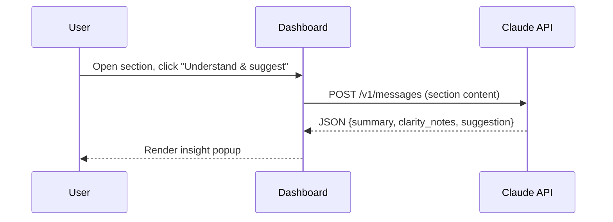
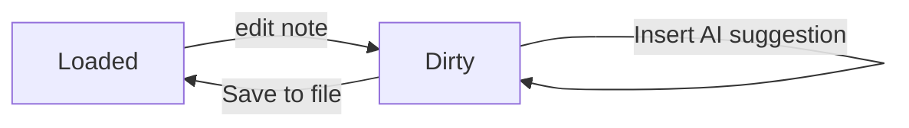

# Feature Showcase: Rendering Every Markdown Element

This document exists purely to exercise every rendering path the dashboard
supports: nested headings, tables, mermaid diagrams, collapsible
`<details>` blocks, and fenced code in several languages.

## Tables

Service tier comparison:

| Tier       | Requests/min | Support        | Price     |
|------------|:------------:|----------------|----------:|
| Free       | 60            | Community      | $0        |
| Pro        | 600           | Email (24h)    | $29/mo    |
| Enterprise | 6000          | Dedicated Slack| Custom    |

## Diagrams

### Request flow



### State machine



## Collapsible sections

<details>
<summary>Click to expand: full environment variable list</summary>

- `ANTHROPIC_API_KEY` — never read from env in this app; the key lives only
  in `localStorage`, entered via Settings.
- `DASHBOARD_DEFAULT_MODEL` — not used yet; model is chosen in Settings.

</details>

<details>
<summary>Click to expand: FAQ</summary>

**Q: Does this send my document anywhere?**
Only the text of the section you open the AI popup for, and only to
`api.anthropic.com`, and only after you've entered your own key.

**Q: What happens to my notes if I reload the file?**
They're stored inline in the Markdown inside HTML comments, so reloading
the same file restores them into the right card.

</details>

## Code in several languages

Python:

```python
def summarize(section: str) -> str:
    """Return a one-line summary (placeholder for the real Claude call)."""
    return section.strip().splitlines()[0][:80]
```

JavaScript:

```javascript
export function toPlainExcerpt(md, maxLen = 160) {
  return md.replace(/[#>*_`]/g, '').trim().slice(0, maxLen);
}
```

Bash:

```bash
python3 -m http.server 8000
open http://localhost:8000/index.html
```

YAML:

```yaml
provider: claude
model: claude-sonnet-5
storage: localStorage-only
```

## Nested structure

### Level 3 heading

Some text directly under an H3.

#### Level 4 heading

- A bullet
- Another bullet
  - Nested bullet

##### Level 5 heading

> A blockquote to make sure blockquote styling and nesting both render
> correctly inside a deeply nested card.

## Closing notes

If every section above rendered without errors — table borders and
striping visible, both mermaid diagrams drawn, both `<details>` blocks
collapsed by default and expandable, and all four code blocks
syntax-highlighted with a working copy/expand toolbar — the renderer is
working end to end.
